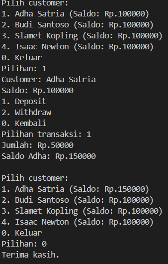

# Bank Assignment

This folder contains a Java-based Object-Oriented Programming assignment focused on creating a simple banking system. The project is designed to apply core OOP principles such as classes, objects, encapsulation, methods, and data collection management.

## Project Purpose

This assignment simulates a basic bank application where users can:

- create bank accounts
- store customer data
- deposit and withdraw money
- check account balances
- view account and customer information
- manage multiple accounts efficiently

## Main Concepts Covered

This project is intended to practice the following programming concepts:

- Object-Oriented Programming (OOP)
- Classes and objects
- Encapsulation
- Constructors and methods
- Data validation
- Array and ArrayList usage
- Basic menu-driven program flow

## Libraries Used

This project uses Java's standard library and does not require any external libraries:

- `java.util.ArrayList` stores the customers in a resizable list in `Bank`. It can grow as customers are added, so the program does not need to set a fixed maximum number of customers.
- `java.util.Scanner` reads the user's menu choices and transaction amounts from the console in `BankDemo`.

## Typical Project Structure

A simple Java banking assignment usually includes files like:

```text
Bank Assignment/
├── src/
│   ├── Main.java
│   ├── Bank.java
│   ├── Account.java
│   ├── Customer.java
│   └── ...
├── README.md
└── ...
```

The exact file names may vary depending on the assignment requirements, but the main idea is to separate responsibilities into classes and manage bank data cleanly.

## Example Features

A typical bank system in this project could include:

- creating a new account
- checking the current balance
- depositing funds
- withdrawing funds
- displaying transaction history or account details
- handling multiple accounts using an ArrayList

## How to Run

If this project is implemented in Java, you can usually run it with:

```bash
javac *.java
java Main
```

Or, if the project is organized in a `src` folder:

```bash
javac src/*.java
java -cp src Main
```
## Screenshot


## Notes

This assignment is a good example of applying OOP in a real-world use case. It helps students understand how to model objects such as `Bank`, `Account`, and `Customer` and how to connect them through methods and data structures.

## Summary

This folder is meant for a simple bank management system project that demonstrates the practical use of Java and object-oriented programming concepts in a realistic scenario.
