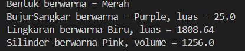

# Square Assignment

This Java assignment demonstrates inheritance and method overriding with geometric shapes.

## Description
The project contains a base `Bentuk` class and three derived shape classes: `BujurSangkar`, `Lingkaran`, and `Silinder`. It demonstrates OOP concepts such as:

- classes and objects
- attributes/fields
- methods
- constructors
- inheritance
- method overriding

## Objective
The purpose of this task is to practice how to:

- represent shapes with Java classes
- calculate square and circle areas and cylinder volume
- reuse and override methods through inheritance

## Project Files

- `Bentuk.java` - base shape class with a color and `printInfo()` method.
- `BujurSangkar.java` - square class with a side length and area calculation.
- `Lingkaran.java` - circle class with a radius and area calculation.
- `Silinder.java` - cylinder class with a height and volume calculation.
- `Driver.java` - creates sample shapes, updates their properties, and prints their information.

## Features Typically Included

- calculate the area of a square and circle
- calculate the volume of a cylinder
- print each shape's color and calculated result

## How to Run

Open a terminal in this folder and run:

```sh
javac *.java
java Driver
```

The sample shape values are set in `Driver.java`; the program does not prompt for keyboard input.

## Screenshot


## Notes

This folder was created for learning purposes as coursework in Object-Oriented Programming. Update this README if the project structure or file names change.

## Author

- Myself

---

This documentation can be updated according to the contents of the folder and the needs of the assignment being worked on.
